<div align="center">

# AKIOR

### Fully Autonomous AI Operating System

[](LICENSE)
[](https://www.apple.com/mac-mini/)
[](https://anthropic.com)
[](https://ollama.ai)
[]()

**Your personal AI chief of staff.**
Manages communications, calendar, business ops, research, and automation across every channel -- fully autonomous, always on.

[Architecture](#architecture) | [Capabilities](#capabilities) | [Channels](#channel-status) | [Tech Stack](#tech-stack) | [Setup](#quick-start)

</div>

---

## What is AKIOR?

AKIOR is a **fully autonomous AI operating system** running 24/7 on a dedicated Mac Mini M4. It receives instructions through natural language across any channel -- WhatsApp, iMessage, phone calls, email, voice -- and executes tasks end-to-end without waiting for approval at each step.

It is not a chatbot. It is an **operating system with agency**: it reads emails, replies to customers, schedules meetings, manages websites, deploys code, runs cron jobs, conducts research, and makes phone calls -- all governed by a constitution that defines its authority, budget, and safety boundaries.

---

## Architecture

```mermaid
graph TB
    Owner["Owner (Yosi)"]

    subgraph Channels["Inbound Channels"]
        WA["WhatsApp"]
        iMsg["iMessage"]
        FT["FaceTime"]
        Phone["Phone / VOIP"]
        Gmail["Gmail"]
        Yahoo["Yahoo Mail"]
        Web["Web Dashboard"]
    end

    subgraph Gateway["OpenClaw Gateway"]
        Router["Message Router"]
        Auth["Auth + Rate Limit"]
        Queue["Task Queue"]
    end

    subgraph Brain["AI Brain"]
        Claude["Claude (Primary)\nReasoning / Planning / Orchestration"]
        Ollama["Ollama (Local)\nClassification / Summarization / Preprocessing"]
    end

    subgraph Tools["Tool Layer"]
        Cal["Calendar"]
        Browse["Web Browser"]
        DB["Supabase DB"]
        FS["File System"]
        Cron["Cron Scheduler"]
        Voice["Voice Calls (clawr.ing)"]
        Wix["Wix Dashboard"]
        Code["Code Deploy"]
    end

    subgraph Output["Execution"]
        Ledger["Audit Ledgers"]
        Dash["Ops Dashboard\nlocalhost:8421"]
        Checkpoint["Safety Checkpoints"]
    end

    Owner --> Channels
    Channels --> Gateway
    Gateway --> Brain
    Brain --> Tools
    Brain --> Output
    Tools --> Output

    style Owner fill:#1a1a2e,stroke:#e94560,color:#fff
    style Gateway fill:#16213e,stroke:#0f3460,color:#fff
    style Brain fill:#0f3460,stroke:#533483,color:#fff
    style Tools fill:#533483,stroke:#e94560,color:#fff
    style Output fill:#1a1a2e,stroke:#e94560,color:#fff
```



---

## Capabilities

### Communication
| Capability | Description |
|---|---|
| **WhatsApp Messaging** | Send and receive messages, handle customer inquiries |
| **iMessage** | Native macOS iMessage integration |
| **Phone Calls** | Outbound/inbound voice calls via clawr.ing |
| **Email (Gmail + Yahoo)** | Read, draft, and send emails across accounts |
| **Customer Ops** | Wix Inbox management for Live Pilates USA |

### Information & Research
| Capability | Description |
|---|---|
| **Web Search & Browse** | Real-time web research with Playwright browser |
| **RAG Knowledge Base** | Governed retrieval-augmented generation with citations |
| **Document Analysis** | PDF, spreadsheet, and document processing |
| **Calendar Management** | Google Calendar read/write with smart scheduling |

### System & DevOps
| Capability | Description |
|---|---|
| **Code Deployment** | Git push, CI/CD, edge function deploys |
| **Cron Scheduling** | Persistent scheduled tasks via LaunchAgents |
| **Database Operations** | Supabase SQL, migrations, and type generation |
| **File System** | Full local filesystem access and management |
| **Health Monitoring** | GitHub Actions CI health checks |

### Automation & Business
| Capability | Description |
|---|---|
| **Multi-Domain Memory** | Isolated memory across 10 life domains |
| **Budget Management** | $500 API + $1,000 task card with local-first routing |
| **Audit Trail** | Every action logged to typed ledgers |
| **Safety Checkpoints** | Pre-irreversible-action snapshots |
| **Self-Improvement** | Continuous capability growth via OpenWolf learning |

---

## Channel Status

| Channel | Status | Protocol |
|---|---|---|
| WhatsApp | **Active** | OpenClaw Gateway |
| iMessage | **Active** | Native macOS |
| Phone / VOIP | **Active** | clawr.ing |
| FaceTime | **Active** | Native macOS |
| Gmail | **Active** | IMAP / API |
| Yahoo Mail | **Active** | Himalaya CLI |
| Web Dashboard | **Active** | localhost:8421 |
| Wix Inbox | **Active** | Browser automation |

---

## Tech Stack

| Layer | Technology |
|---|---|
| **Hardware** | Mac Mini M4, always-on |
| **Primary AI** | Claude Opus 4 (Anthropic) |
| **Local AI** | Ollama (Llama / Mistral) |
| **Gateway** | OpenClaw |
| **Database** | Supabase (Postgres + pgvector) |
| **Browser Automation** | Playwright |
| **Voice** | clawr.ing |
| **Email** | Himalaya CLI + Gmail API |
| **Scheduling** | macOS LaunchAgents |
| **CI/CD** | GitHub Actions |
| **Context Management** | OpenWolf |
| **Frontend** | Next.js + Tailwind CSS |

---

## Quick Start

```bash
# Clone the repository
git clone https://github.com/yosiwizman/AKIOR_AUOTONOMUS_ASSISTENT.git
cd AKIOR_AUOTONOMUS_ASSISTENT

# AKIOR runs as a persistent Claude Code session on the host machine.
# The OpenClaw gateway and dashboard start via LaunchAgents:
launchctl load ~/Library/LaunchAgents/ai.openclaw.gateway.plist
launchctl load ~/Library/LaunchAgents/com.akior.dashboard.plist
launchctl load ~/Library/LaunchAgents/com.akior.dashboard-api.plist

# Verify the ops dashboard
open http://localhost:8421
```

> AKIOR is designed to run on a dedicated Mac Mini. It requires macOS for native iMessage/FaceTime integration, local Ollama models, and LaunchAgent scheduling. See the [SSOT documentation](docs/ssot/) for full configuration details.

---

## Governance

AKIOR operates under a formal constitution ([AKIOR-OS-SSOT-v1.0](docs/ssot/AKIOR-OS-SSOT-v1.0-EXPERIMENT-LOCK.md)) that defines:

- **Full autonomy** -- no per-task approval required
- **Budget limits** -- $500 API + $1,000 task card
- **Safety protocol** -- checkpoint before irreversible actions, sandbox/dry-run first
- **Audit trail** -- every action, tool use, financial transaction, deployment, and decision logged
- **10-domain isolation** -- personal, family, business, software, product, SEO/marketing, travel, research, communications, legal

---

## License

[MIT](LICENSE) -- Copyright 2026 Yosi Wizman

---

<div align="center">
<sub>Built with autonomy. Governed by constitution. Powered by Claude.</sub>
</div>
